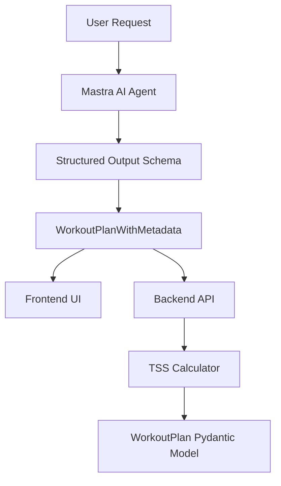

# Workout Plan Schema Integration

This document describes how the WorkoutPlan schema from the peakflow analytics system is integrated with the Mastra AI agent in the Next.js application.

## 🏗️ Architecture Overview

The integration connects three key components:

1. **Python Backend**: WorkoutPlan Pydantic models in `peakflow.analytics.tss`
2. **TypeScript Frontend**: Type definitions in `src/types/workout.ts`
3. **AI Agent**: Structured output schema in `app/api/workout/route.ts`

## 📝 Schema Definitions

### Python Schema (Backend)

Located in `/application/peakflow/peakflow/analytics/tss.py`:

```python
class WorkoutPlanSegment(BaseModel):
    """Represents a segment of a workout plan with specific intensity and duration."""
    duration_minutes: float = Field(..., gt=0, description="Duration in minutes (must be positive)")
    intensity_metric: Literal['power', 'heart_rate', 'pace'] = Field(..., description="Type of intensity metric")
    target_value: float = Field(..., gt=0, description="Target intensity value (watts, bpm, or min/km)")

class WorkoutPlan(BaseModel):
    """Represents a complete workout plan as a collection of segments."""
    segments: List[WorkoutPlanSegment] = Field(..., min_length=1, description="Workout segments")
    name: Optional[str] = Field(None, description="Optional workout name")
    description: Optional[str] = Field(None, description="Optional workout description")
```

### TypeScript Schema (Frontend)

Located in `src/types/workout.ts`:

```typescript
export interface WorkoutPlanSegment {
  duration_minutes: number;
  intensity_metric: IntensityMetric;
  target_value: number;
}

export interface WorkoutPlan {
  segments: WorkoutPlanSegment[];
  name?: string;
  description?: string;
}

export interface WorkoutPlanWithMetadata {
  workoutPlan: WorkoutPlan;
  metadata: {
    total_duration_minutes: number;
    primary_focus: string;
    intensity_distribution: {
      easy_percentage: number;
      moderate_percentage: number;
      hard_percentage: number;
    };
    estimated_tss?: number;
    difficulty_level: DifficultyLevel;
    equipment_needed: string[];
  };
}
```

### Zod Schema (AI Agent Output)

Located in `app/api/workout/route.ts`:

```typescript
const outputSchema = z.object({
  workoutPlan: z.object({
    name: z.string().optional().describe("Optional workout name"),
    description: z.string().optional().describe("Optional workout description"),
    segments: z.array(z.object({
      duration_minutes: z.number().positive().describe("Duration in minutes (must be positive)"),
      intensity_metric: z.enum(['power', 'heart_rate', 'pace']).describe("Type of intensity metric"),
      target_value: z.number().positive().describe("Target intensity value (watts, bpm, or min/km)")
    })).min(1).describe("Workout segments - at least one required"),
  }).describe("Complete workout plan as a collection of segments"),
  
  metadata: z.object({
    total_duration_minutes: z.number().describe("Total workout duration calculated from all segments"),
    primary_focus: z.string().describe("Main training focus (e.g., 'endurance', 'intervals', 'recovery')"),
    intensity_distribution: z.object({
      easy_percentage: z.number().min(0).max(100).describe("Percentage of time in easy/recovery zones"),
      moderate_percentage: z.number().min(0).max(100).describe("Percentage of time in moderate zones"),
      hard_percentage: z.number().min(0).max(100).describe("Percentage of time in hard/anaerobic zones")
    }).describe("Distribution of workout intensity across different zones"),
    estimated_tss: z.number().optional().describe("Estimated Training Stress Score if calculable"),
    difficulty_level: z.enum(['beginner', 'intermediate', 'advanced', 'elite']).describe("Recommended fitness level"),
    equipment_needed: z.array(z.string()).describe("Required equipment (e.g., 'power meter', 'heart rate monitor')")
  }).describe("Additional workout metadata for context and planning")
}).describe("Structured workout plan output matching the WorkoutPlan schema from peakflow analytics")
```

## 🔄 Data Flow



## 💡 Key Features

### 1. **Type Safety**
- Full TypeScript type checking across the application
- Runtime validation with Zod schemas
- Type guards for safe data handling

### 2. **Schema Consistency**
- Identical field names and structures across Python and TypeScript
- Consistent validation rules and constraints
- Shared documentation and descriptions

### 3. **Enhanced Metadata**
- Extended schema includes training context and planning information
- Intensity distribution analysis for better workout balance
- Equipment requirements and difficulty level assessment

### 4. **Validation & Error Handling**
- Client-side validation with TypeScript types
- Server-side validation with Pydantic models
- AI output validation with Zod schemas

## 🛠️ Usage Examples

### Creating a Workout Plan

```typescript
import { WorkoutPlan, WorkoutPlanUtils } from '../types/workout';

const workoutPlan: WorkoutPlan = {
  name: "5x5 Threshold Intervals",
  description: "Classic threshold workout with 5-minute intervals",
  segments: [
    {
      duration_minutes: 10,
      intensity_metric: 'power',
      target_value: 200  // Warm-up at 200W
    },
    {
      duration_minutes: 5,
      intensity_metric: 'power',
      target_value: 280  // Threshold interval at 280W
    },
    {
      duration_minutes: 2,
      intensity_metric: 'power',
      target_value: 150  // Recovery at 150W
    }
    // ... repeat intervals
  ]
};

// Calculate total duration
const totalDuration = WorkoutPlanUtils.getTotalDuration(workoutPlan);
console.log(`Total workout time: ${totalDuration} minutes`);
```

### Validating User Input

```typescript
import { isWorkoutPlan, isWorkoutPlanWithMetadata } from '../types/workout';

function processWorkoutData(data: unknown) {
  if (isWorkoutPlanWithMetadata(data)) {
    // Safe to use as WorkoutPlanWithMetadata
    console.log(`Workout: ${data.workoutPlan.name}`);
    console.log(`Duration: ${data.metadata.total_duration_minutes} minutes`);
    console.log(`Focus: ${data.metadata.primary_focus}`);
  } else if (isWorkoutPlan(data.workoutPlan)) {
    // Safe to use as WorkoutPlan
    const duration = WorkoutPlanUtils.getTotalDuration(data.workoutPlan);
    console.log(`Basic workout plan, ${duration} minutes`);
  } else {
    throw new Error('Invalid workout plan data');
  }
}
```

### AI Agent Integration

The AI agent now produces structured output that matches the schema:

```typescript
// Agent automatically generates structured output like:
{
  workoutPlan: {
    name: "Endurance Base Build",
    description: "2-hour aerobic base building ride",
    segments: [
      {
        duration_minutes: 15,
        intensity_metric: "power",
        target_value: 180
      },
      {
        duration_minutes: 90,
        intensity_metric: "heart_rate", 
        target_value: 145
      },
      {
        duration_minutes: 15,
        intensity_metric: "power",
        target_value: 160
      }
    ]
  },
  metadata: {
    total_duration_minutes: 120,
    primary_focus: "aerobic_endurance",
    intensity_distribution: {
      easy_percentage: 85,
      moderate_percentage: 15,
      hard_percentage: 0
    },
    difficulty_level: "intermediate",
    equipment_needed: ["power_meter", "heart_rate_monitor"]
  }
}
```

## ✅ Benefits

1. **Consistency**: Same data structure across Python backend and TypeScript frontend
2. **Type Safety**: Full compile-time checking and runtime validation
3. **AI Integration**: Structured output ensures reliable data from AI agents
4. **Extensibility**: Easy to add new fields while maintaining compatibility
5. **Validation**: Multi-layer validation prevents data corruption
6. **Developer Experience**: Rich IDE support with autocompletion and error checking

## 🔧 Maintenance

When updating the schema:

1. **Update Python model** in `peakflow/analytics/tss.py`
2. **Update TypeScript types** in `src/types/workout.ts`
3. **Update Zod schema** in `app/api/workout/route.ts`
4. **Run tests** to ensure compatibility
5. **Update documentation** as needed

This ensures all three layers stay synchronized and maintain type safety throughout the application.